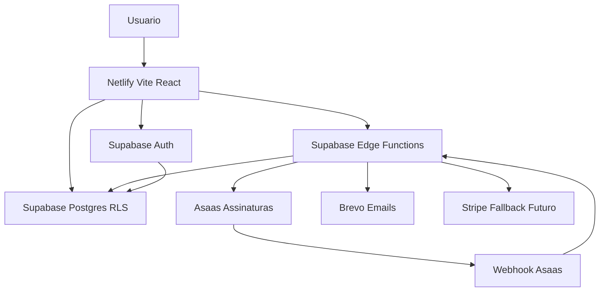

# Plano de Implementacao do FestaAI

## 1. Objetivo

Transformar o prototipo atual do FestaAI em um SaaS real, funcional, seguro, multi-tenant e preparado para venda para casas de festas infantis.

O produto deve continuar simples, visual, moderno, rapido e orientado a acao. A UI criada no Lovable deve ser reaproveitada ao maximo, evoluindo a base atual de dados mockados para uma arquitetura com Supabase, RLS, Edge Functions, Asaas, Brevo e deploy futuro na Netlify.

## 2. Diagnostico Inicial Esperado

### 2.1 Estado atual do projeto

- O projeto e um frontend Vite, React e TypeScript.
- A UI tem forte evidencia de origem Lovable:
  - `lovable-tagger` configurado em `vite.config.ts`.
  - `README.md` ainda com texto padrao de projeto Lovable.
  - Nome do pacote como `vite_react_shadcn_ts`.
- A interface ja possui boa cobertura visual dos modulos principais:
  - Dashboard em `src/pages/Index.tsx`.
  - CRM em `src/pages/CRM.tsx`.
  - Detalhe do evento em `src/pages/EventoDetalhe.tsx`.
  - Calendario em `src/pages/Calendario.tsx`.
  - Relatorios em `src/pages/Relatorios.tsx`.
  - Configuracoes em `src/pages/Configuracoes.tsx`.
  - Pagina de contratacao em `src/pages/Contratar.tsx`.
- A base de componentes reutilizaveis Shadcn/Radix ja existe em `src/components/ui`.
- Existem componentes de produto reaproveitaveis:
  - `src/components/KanbanBoard.tsx`.
  - `src/components/MetricCard.tsx`.
  - `src/components/MiniCalendar.tsx`.
  - `src/components/PartyList.tsx`.
  - `src/components/EventChecklist.tsx`.
  - `src/components/*Report.tsx`.
  - `src/components/*Config.tsx`.
- Os dados estao mockados em `src/data`, especialmente:
  - `src/data/mockEvents.ts`.
  - `src/data/packagesData.ts`.
  - `src/data/plansData.ts`.
  - `src/data/checklistConfig.ts`.
  - `src/data/calendarAvailability.ts`.
- O React Query ja esta configurado em `src/App.tsx`, mas ainda nao e usado como camada real de dados.
- Nao ha cliente Supabase, rotas protegidas, autenticacao, multi-tenancy, migrations, Edge Functions ou deploy configurado.

### 2.2 Lacunas tecnicas encontradas

- Nao existe diretorio `supabase/`.
- Nao existe `src/lib/supabase/client.ts`.
- Nao ha uso de `import.meta.env` no frontend.
- Nao ha `.env.example` documentando variaveis publicas e privadas.
- Nao ha fluxo de login, cadastro, recuperacao de senha ou guards de rotas.
- Nao ha RLS, policies, tabelas multi-tenant ou membros de organizacao.
- Nao ha integracao com Asaas, Stripe, Brevo ou webhooks.
- Nao ha `netlify.toml`.
- Nao ha CI versionado.
- `vite.config.ts` usa porta `8080`, divergente da regra local de porta `3000`.
- Existem multiplos lockfiles (`pnpm-lock.yaml`, `package-lock.json`, `bun.lock`), mas o padrao do projeto deve ser apenas `pnpm`.
- `tsconfig.app.json` esta com `strict: false`.
- O dashboard e varios relatorios exibem valores estaticos ou derivados de mocks.
- O Kanban possui drag and drop local, sem persistencia.
- O detalhe do evento usa estado local para tarefas, notas e pagamentos.
- A area de configuracoes ainda representa preferencias em UI estatica, sem persistencia por tenant.

### 2.3 Ativos que devem ser preservados

- Layout principal com sidebar em `src/components/AppLayout.tsx` e `src/components/AppSidebar.tsx`.
- Design system atual com tokens em `src/index.css` e extensoes em `tailwind.config.ts`.
- Componentes genericos em `src/components/ui`.
- Estrutura visual de dashboard, cards, calendario, funis, relatorios e configuracoes.
- Tipos e funis de `src/data/mockEvents.ts` como referencia inicial do dominio.
- Pagina `/contratar` como base para fluxo comercial e integracao Asaas.

## 3. Principios de Arquitetura

### 3.1 Entidade central

A entidade principal do sistema deve ser `eventos`.

Nao devem ser criadas entidades separadas como `leads`, `festas` ou `pos_venda` para representar a mesma jornada. O funil e a etapa atual do evento determinam em qual momento operacional ele esta.

### 3.2 Multi-tenancy

- Toda tabela de negocio deve conter `tenant_id`.
- Cada usuario acessa dados somente dos tenants onde possui membership ativo.
- RLS deve ser habilitado em todas as tabelas sensiveis.
- A validacao de acesso deve acontecer no banco e nas Edge Functions.
- O frontend nunca deve confiar apenas em checks de UI.

### 3.3 Seguranca de chaves

- Chaves `service_role`, Asaas, Stripe e Brevo nunca devem ir para o frontend.
- Variaveis `VITE_*` devem conter apenas valores publicos, como URL do Supabase e anon key.
- Secrets de integracao devem ficar no ambiente das Supabase Edge Functions.
- Netlify deve armazenar apenas variaveis publicas do app e configuracoes sem segredo sensivel.

### 3.4 Integracoes

- Asaas sera o provedor principal de assinaturas.
- Stripe deve ser previsto como fallback futuro por meio de uma camada de abstracao de pagamentos.
- Brevo sera usado para e-mails transacionais.
- Follow-ups comerciais e operacionais nao serao automatizados internamente; serao tratados externamente via n8n.

### 3.5 UX e identidade visual

- Manter interface clara para usuarios nao tecnicos.
- Reaproveitar o estilo atual com Shadcn, Radix, Tailwind e cards.
- Ajustar a identidade para as cores:
  - Principais: `#000000` e `#ececec`.
  - Apoio: `#5158e7`, `#e57369`, `#d95693`, `#e6bce9`.
- Usar gradiente suave entre azul, rosa, roxo e preto.
- Priorizar cards claros sobre fundo escuro ou gradiente quando fizer sentido.
- O dashboard deve responder rapidamente a pergunta: "O que precisa de acao agora?"

## 4. Arquitetura Alvo

### 4.1 Camadas recomendadas no frontend

- `src/lib/supabase/client.ts`: cliente Supabase browser com URL e anon key.
- `src/features/auth`: fluxo de autenticacao, sessao e guards.
- `src/features/tenants`: tenant atual, memberships e selecao de empresa.
- `src/features/eventos`: queries, mutations, formularios e regras de funil.
- `src/features/dashboard`: indicadores e listas de acao.
- `src/features/configuracoes`: pacotes, adicionais, mensagens, regras financeiras e processo.
- `src/features/billing`: status de assinatura, checkout e portal.
- `src/features/reports`: consultas agregadas e visualizacoes.
- `src/components`: componentes de produto existentes reorganizados gradualmente por caso de uso.
- `src/components/ui`: componentes genericos reutilizaveis.

### 4.2 Camadas recomendadas no Supabase

- `supabase/migrations`: schema, indices, RLS, functions SQL e seeds minimos.
- `supabase/functions`: Edge Functions para operacoes sensiveis:
  - Billing com Asaas.
  - Webhooks Asaas.
  - E-mails via Brevo.
  - Onboarding de tenant.
  - Fallback futuro de pagamentos.

## 5. Modelo de Dados Previsto

### 5.1 Tabelas de plataforma

- `tenants`
  - Empresas clientes do FestaAI.
  - Campos previstos: `id`, `name`, `slug`, `document`, `phone`, `email`, `status`, `created_at`, `updated_at`.
- `tenant_members`
  - Relacao entre usuarios Supabase Auth e tenants.
  - Campos previstos: `id`, `tenant_id`, `user_id`, `role`, `status`, `created_at`, `updated_at`.
  - Roles iniciais: `owner`, `admin`, `member`.
- `profiles`
  - Dados complementares do usuario.
  - Campos previstos: `id`, `full_name`, `phone`, `created_at`, `updated_at`.
- `audit_logs`
  - Registro de acoes sensiveis.
  - Campos previstos: `id`, `tenant_id`, `actor_user_id`, `action`, `entity_type`, `entity_id`, `metadata`, `created_at`.

### 5.2 Tabelas de negocio

- `eventos`
  - Entidade central da jornada.
  - Campos previstos:
    - `id`, `tenant_id`.
    - `cliente_nome`, `cliente_telefone`, `cliente_email`.
    - `aniversariante_nome`, `aniversariante_data_nascimento`.
    - `data_evento`, `hora_evento`, `quantidade_convidados`.
    - `pacote_id`, `valor_pacote`, `valor_adicionais`, `valor_total`, `valor_entrada`.
    - `funil`, `etapa`, `status_interno`, `tipo_evento`.
    - `origem`, `motivo_perda`, `observacoes`.
    - `created_by`, `updated_by`, `created_at`, `updated_at`.
- `evento_pagamentos`
  - Pagamentos vinculados ao evento.
  - Campos previstos: `id`, `tenant_id`, `evento_id`, `data_pagamento`, `valor`, `metodo`, `status`, `external_id`, `created_at`.
- `evento_tarefas`
  - Checklist e tarefas operacionais por evento.
  - Campos previstos: `id`, `tenant_id`, `evento_id`, `titulo`, `descricao`, `status`, `due_date`, `ordem`, `created_at`, `updated_at`.
- `evento_notas`
  - Anotacoes internas do evento.
  - Campos previstos: `id`, `tenant_id`, `evento_id`, `author_user_id`, `texto`, `created_at`.
- `evento_anexos`
  - Metadados de arquivos futuros, caso o produto precise de contratos, imagens ou PDFs.
  - Campos previstos: `id`, `tenant_id`, `evento_id`, `storage_path`, `file_name`, `content_type`, `created_at`.

### 5.3 Tabelas de configuracao por tenant

- `pacotes`
  - Pacotes comerciais da casa de festas.
- `pacote_precos`
  - Faixas de preco por quantidade de convidados, dia de semana ou regra comercial.
- `adicionais`
  - Itens extras, como fotografia, DJ, hora extra, convidados extras.
- `checklist_templates`
  - Modelos de tarefas geradas por etapa ou pacote.
- `message_templates`
  - Mensagens padrao para copiar, usar manualmente ou integrar externamente.
  - Importante: sem automacao interna de follow-up.
- `tenant_settings`
  - Regras financeiras e preferenciais:
    - entrada padrao.
    - parcelas maximas.
    - etapas ativas.
    - timezone.
    - preferencias visuais ou operacionais.
- `calendar_blocks`
  - Bloqueios manuais de datas e horarios.

### 5.4 Tabelas de assinatura e integracoes

- `subscription_plans`
  - Planos comerciais do SaaS FestaAI.
- `tenant_subscriptions`
  - Assinatura ativa de cada tenant.
- `billing_customers`
  - Relacao entre tenant e customer externo.
- `billing_subscriptions`
  - Relacao com assinatura externa do Asaas ou Stripe futuro.
- `billing_invoices`
  - Faturas, cobrancas e status.
- `payment_provider_events`
  - Eventos de webhook com idempotencia.
- `email_events`
  - Logs de envio via Brevo.
- `integration_settings`
  - Configuracoes nao secretas por tenant.
  - Secrets devem ficar em ambiente seguro, nao nessa tabela.

## 6. Migrations Previstas

### 6.1 Fundacao

- Criar extensoes necessarias:
  - `pgcrypto` para UUIDs.
  - Extensoes auxiliares conforme necessidade do Supabase.
- Criar enums ou checks controlados para:
  - Funis: `vendas`, `festa`, `executadas`.
  - Etapas:
    - Vendas: `contato_inicial`, `proposta_enviada`, `negociacao`, `visita_agendada`, `fechado`, `perdido`.
    - Festa: `boas_vindas`, `planejamento`, `contrato`, `organizacao`, `festa_pronta`.
    - Executadas: `aguardando_feedback`, `redes_sociais`, `oportunidade_futura`.
  - Roles: `owner`, `admin`, `member`.
  - Status de assinatura e cobranca.

### 6.2 Multi-tenancy e Auth

- Criar `profiles`.
- Criar `tenants`.
- Criar `tenant_members`.
- Criar indexes por `tenant_id`, `user_id` e `status`.
- Criar function SQL `is_tenant_member(target_tenant_id uuid)`.
- Criar function SQL `has_tenant_role(target_tenant_id uuid, allowed_roles text[])`.
- Habilitar RLS em `profiles`, `tenants` e `tenant_members`.
- Criar policies de leitura e escrita por membership.

### 6.3 Eventos e operacao

- Criar `eventos` com `tenant_id` obrigatorio.
- Criar `evento_pagamentos`.
- Criar `evento_tarefas`.
- Criar `evento_notas`.
- Criar `evento_anexos`.
- Criar constraints para impedir etapa invalida por funil.
- Criar indexes para:
  - `tenant_id`.
  - `tenant_id, funil, etapa`.
  - `tenant_id, data_evento`.
  - `tenant_id, status_interno`.
- Habilitar RLS em todas as tabelas.

### 6.4 Configuracoes do cliente

- Criar `pacotes`.
- Criar `pacote_precos`.
- Criar `adicionais`.
- Criar `checklist_templates`.
- Criar `message_templates`.
- Criar `tenant_settings`.
- Criar `calendar_blocks`.
- Habilitar RLS e policies por `tenant_id`.

### 6.5 Billing e integracoes

- Criar `subscription_plans`.
- Criar `tenant_subscriptions`.
- Criar `billing_customers`.
- Criar `billing_subscriptions`.
- Criar `billing_invoices`.
- Criar `payment_provider_events`.
- Criar `email_events`.
- Criar `integration_settings`.
- Criar unique constraints para ids externos e idempotencia de webhooks.
- Habilitar RLS com leitura limitada por tenant e escrita sensivel apenas via Edge Functions.

### 6.6 Observabilidade e auditoria

- Criar `audit_logs`.
- Criar triggers de `updated_at`.
- Criar triggers opcionais de auditoria para alteracoes sensiveis.
- Criar views ou RPCs para agregacoes do dashboard e relatorios.

## 7. Edge Functions Previstas

### 7.1 `onboard-tenant`

- Cria tenant, membership owner, settings padrao, pacotes iniciais e templates.
- Deve validar entrada com zod.
- Deve ser chamada apos cadastro ou por fluxo administrativo.

### 7.2 `create-asaas-checkout`

- Cria ou reutiliza customer no Asaas.
- Cria assinatura conforme plano selecionado.
- Retorna URL ou dados seguros para continuar contratacao.
- Nunca expor API key do Asaas ao frontend.

### 7.3 `asaas-webhook`

- Recebe eventos do Asaas.
- Valida token/assinatura conforme mecanismo disponivel.
- Registra evento bruto em `payment_provider_events`.
- Processa com idempotencia.
- Atualiza `billing_invoices`, `billing_subscriptions` e `tenant_subscriptions`.

### 7.4 `cancel-subscription`

- Cancela assinatura no Asaas.
- Atualiza status local.
- Gera audit log.

### 7.5 `send-transactional-email`

- Envia e-mails transacionais via Brevo.
- Casos iniciais:
  - Boas-vindas ao tenant.
  - Convite de usuario.
  - Confirmacao de contratacao.
  - Avisos administrativos de billing.
- Registra envio em `email_events`.

### 7.6 `invite-member`

- Convida usuario para um tenant.
- Cria convite ou membership pendente.
- Envia e-mail via Brevo.
- Garante que apenas `owner` ou `admin` possam convidar.

### 7.7 `billing-provider-router`

- Camada futura para abstrair provedores.
- Inicialmente direciona para Asaas.
- Deve prever Stripe como fallback futuro sem espalhar condicionais pelo frontend.

## 8. Fases de Implementacao

## Fase 0 - Auditoria e Preparacao do Repositorio

**Status:** concluida em 2026-05-06.

Resumo detalhado: `docs/phase-0-summary.md`.

### Epic

Preparar o projeto para evoluir de prototipo Lovable para SaaS versionado, consistente e seguro.

### User stories

- Como tech lead, quero conhecer a estrutura atual para reaproveitar a UI sem reescrever o produto do zero.
- Como desenvolvedor, quero padronizar scripts e ambiente local para reduzir problemas de setup.
- Como equipe, quero documentar variaveis, portas e decisoes para acelerar manutencao.

### Tarefas tecnicas

- Documentar no README a visao do FestaAI, stack, scripts e padrao `pnpm`.
- Ajustar `vite.config.ts` para rodar localmente na porta `3000`.
- Remover ambiguidade de lockfiles, mantendo `pnpm-lock.yaml` como fonte unica quando aprovado.
- Criar `.env.example` sem segredos.
- Tipar `ImportMetaEnv` em `src/vite-env.d.ts`.
- Mapear todos os imports de `src/data/*` que precisarao virar queries.
- Validar baseline com `pnpm lint`, `pnpm test` e `pnpm build`.
- Avaliar ativacao gradual de TypeScript strict, pois `tsconfig.app.json` esta com `strict: false`.

### Arquivos provaveis a alterar

- `README.md`.
- `vite.config.ts`.
- `package.json`.
- `src/vite-env.d.ts`.
- `.env.example`.
- `.gitignore`.
- `tsconfig.app.json`.

### Criterios de aceite

- `pnpm dev` inicia em `http://localhost:3000`.
- Ambiente documentado sem expor segredos.
- Apenas `pnpm` fica definido como gerenciador oficial.
- Build, lint e testes baseline sao conhecidos e documentados.

## Fase 1 - Fundacao Supabase, Auth e Multi-tenant

**Status:** concluida como fundacao inicial em 2026-05-06.

Resumo detalhado: `docs/phase-1-summary.md`.

Entregue:

- Cliente Supabase tipado no frontend.
- Auth global com login, logout e guards de rota.
- Migration `profiles`, `tenants` e `tenant_members` aplicada no Supabase remoto.
- IDs de tenant ajustados para `int8` (`profiles.id` permanece `uuid` por referencia ao Supabase Auth).
- RLS habilitado nas novas tabelas e policies por membership/role.
- Tenant atual carregado no frontend e exigido nas rotas internas.
- Usuario e tenant de teste criados para validacao.

Pendencias movidas para proximos itens/fases:

- Cadastro publico, recuperacao de senha e convite de membros.
- Edge Functions `onboard-tenant`, `invite-member` e `send-transactional-email`.
- Seletor visual de tenant para multiempresa.
- Revisao de RLS em tabelas legadas com RLS desabilitado: `NOVO_LEAD`, `n8n_chat_histories` e `documents`.

### Epic

Implementar a base segura de autenticacao, tenants e isolamento de dados.

### User stories

- Como dono de casa de festas, quero criar minha conta e acessar somente os dados da minha empresa.
- Como administrador, quero convidar membros para minha empresa.
- Como usuario, quero entrar, sair e recuperar acesso com seguranca.
- Como operador do sistema, quero que nenhuma empresa consiga acessar dados de outra.

### Tarefas tecnicas

- Criar estrutura `supabase/`.
- Criar migrations iniciais de `profiles`, `tenants` e `tenant_members`.
- Habilitar RLS nas tabelas.
- Criar policies baseadas em membership.
- Criar cliente Supabase em `src/lib/supabase/client.ts`.
- Criar camada de auth em `src/features/auth`.
- Criar guards de rota em `src/App.tsx`.
- Criar contexto ou hook de tenant atual em `src/features/tenants`.
- Adicionar telas ou fluxos de login, cadastro, recuperar senha e escolher tenant.
- Garantir que rotas de produto usem tenant ativo.

### Migrations

- `0001_create_profiles.sql`.
- `0002_create_tenants_and_members.sql`.
- `0003_enable_tenant_rls.sql`.

### Edge Functions

- `onboard-tenant`.
- `invite-member`.
- `send-transactional-email` para convites e boas-vindas.

### Arquivos provaveis a alterar

- `src/App.tsx`.
- `src/lib/supabase/client.ts`.
- `src/features/auth/*`.
- `src/features/tenants/*`.
- `src/components/AppLayout.tsx`.
- `src/components/AppSidebar.tsx`.
- `supabase/migrations/*`.
- `supabase/functions/onboard-tenant/*`.
- `supabase/functions/invite-member/*`.

### Criterios de aceite

- Usuario autenticado acessa apenas tenants onde tem membership.
- Usuario sem sessao e redirecionado para login.
- RLS bloqueia acesso cross-tenant mesmo com chamadas manuais.
- Novo tenant recebe configuracoes padrao.

## Fase 2 - Modelo Central de Eventos e Persistencia do CRM

**Status:** concluida.

Entregue ate agora:

- Migration `eventos` criada e aplicada no Supabase remoto.
- `eventos.id` e `eventos.tenant_id` definidos como `int8`.
- RLS habilitado em `eventos` com policies por membership/role.
- Constraints criadas para funil, etapa, status interno, tipo de evento e valores.
- Indices principais criados por tenant, funil/etapa, data do evento e status.
- Insert/select/delete validado via cliente publico autenticado e RLS.
- Tipos Supabase atualizados no frontend com a tabela `eventos`.
- Feature `src/features/eventos` criada com tipos de dominio, constantes de funis/etapas e hooks `useEventos`/`useEvento`.
- `src/pages/CRM.tsx` migrado de `mockEvents` para `useEventos`.
- `src/components/KanbanBoard.tsx` adaptado para consumir a tabela real `eventos` mantendo o visual atual.
- Drag and drop do Kanban conectado ao Supabase com mutation `useUpdateEventoStage`, atualizacao otimista e rollback em erro.
- `src/pages/EventoDetalhe.tsx` conectado ao hook `useEvento`, exibindo dados reais da tabela `eventos` com estados de loading, erro e nao encontrado.
- Migration `evento_operational_tables` criada e aplicada no Supabase remoto para `evento_pagamentos`, `evento_tarefas` e `evento_notas`.
- Tabelas operacionais criadas com `int8`, `tenant_id`, FK composta com `eventos(id, tenant_id)`, indices, triggers `updated_at` e RLS.
- Hooks React Query criados para criar/editar eventos e persistir pagamentos, tarefas e notas.
- `src/pages/EventoDetalhe.tsx` conectado a pagamentos, tarefas e notas persistidos.
- Formulario `EventoFormDialog` criado para criacao/edicao de eventos com zod e validacao de etapa por funil.
- `pnpm typecheck`, `pnpm lint` e `pnpm build` executados com sucesso; permanecem apenas warnings conhecidos de Fast Refresh em componentes Shadcn.

### Epic

Substituir o CRM mockado por dados reais persistidos em Supabase, mantendo `eventos` como entidade central.

### User stories

- Como vendedor, quero cadastrar um evento desde o primeiro contato.
- Como vendedor, quero mover eventos entre etapas do funil de vendas.
- Como operador, quero acompanhar o mesmo evento durante planejamento, contrato, organizacao, execucao e pos-venda.
- Como gestor, quero ver historico, tarefas, notas e pagamentos de cada evento.

### Tarefas tecnicas

- Criar migrations de `eventos`, `evento_pagamentos`, `evento_tarefas` e `evento_notas`.
- Migrar tipos de `src/data/mockEvents.ts` para modelos em `src/features/eventos`.
- Criar hooks React Query:
  - `useEventos`.
  - `useEvento`.
  - `useCreateEvento`.
  - `useUpdateEventoStage`.
  - `useEventoPagamentos`.
  - `useEventoTarefas`.
  - `useEventoNotas`.
- Conectar `src/pages/CRM.tsx` ao Supabase.
- Persistir drag and drop do `src/components/KanbanBoard.tsx`.
- Conectar `src/pages/EventoDetalhe.tsx` a dados reais.
- Criar formulario de criacao/edicao de evento com zod.
- Garantir validacao de etapa por funil.
- Manter funis definidos no PRD:
  - Vendas: Contato Inicial, Proposta Enviada, Negociacao, Visita Agendada, Fechado, Perdido.
  - Festa: Boas Vindas, Planejamento, Contrato, Organizacao, Festa Pronta.
  - Executadas: Aguardando Feedback, Redes Sociais, Oportunidade Futura.

### Migrations

- `0004_create_eventos.sql`.
- `0005_create_evento_operational_tables.sql`.
- `0006_eventos_rls_and_indexes.sql`.

### Edge Functions

- Nenhuma obrigatoria para CRUD simples, desde que RLS cubra corretamente.
- Considerar Edge Function apenas para acoes sensiveis futuras.

### Arquivos provaveis a alterar

- `src/data/mockEvents.ts`.
- `src/pages/CRM.tsx`.
- `src/components/KanbanBoard.tsx`.
- `src/pages/EventoDetalhe.tsx`.
- `src/components/EventChecklist.tsx`.
- `src/features/eventos/*`.
- `supabase/migrations/*`.

### Criterios de aceite

- Eventos sao listados por tenant.
- Movimento no Kanban persiste apos reload.
- Detalhe do evento exibe dados reais.
- Pagamentos, tarefas e notas persistem.
- Nenhum dado de outro tenant aparece em listagens, detalhes ou buscas.

## Fase 3 - Dashboard Acionavel e Calendario Operacional

### Epic

Transformar o dashboard e calendario em centro de controle real da empresa.

### User stories

- Como gestor, quero ver o que precisa de acao hoje.
- Como operador, quero acompanhar proximas festas e pendencias.
- Como financeiro, quero ver valores vendidos, recebidos e pendentes.
- Como equipe, quero bloquear datas no calendario e visualizar ocupacao.

### Tarefas tecnicas

- Criar RPCs ou views para metricas do dashboard.
- Substituir valores estaticos em `src/pages/Index.tsx`.
- Conectar `PartyList`, `MiniCalendar` e `AlertItem` a eventos reais.
- Criar query de "Precisa de Atencao":
  - propostas sem retorno.
  - contratos pendentes.
  - pagamentos atrasados.
  - planejamento parado.
  - feedback pendente.
- Persistir bloqueios de calendario em `calendar_blocks`.
- Substituir mutacoes em memoria de `src/data/calendarAvailability.ts`.
- Criar estados de loading, erro e vazio com linguagem simples.

### Migrations

- `0007_create_calendar_blocks.sql`.
- `0008_dashboard_views_or_rpcs.sql`.

### Edge Functions

- Opcional: agregacoes podem ficar em SQL/RPC com RLS.

### Arquivos provaveis a alterar

- `src/pages/Index.tsx`.
- `src/pages/Calendario.tsx`.
- `src/components/MiniCalendar.tsx`.
- `src/components/PartyList.tsx`.
- `src/components/AlertItem.tsx`.
- `src/components/DayDetailPanel.tsx`.
- `src/data/calendarAvailability.ts`.
- `src/features/dashboard/*`.
- `src/features/calendario/*`.

### Criterios de aceite

- Dashboard mostra metricas reais por tenant.
- Lista de acao e derivada de eventos reais.
- Calendario exibe eventos e bloqueios persistidos.
- Usuario entende rapidamente as prioridades do dia.

## Fase 4 - Central de Controle por Cliente

### Epic

Persistir configuracoes comerciais e operacionais por tenant.

### User stories

- Como gestor, quero configurar pacotes, adicionais e valores.
- Como gestor, quero configurar regras financeiras padrao.
- Como operador, quero configurar checklists e mensagens padrao.
- Como empresa, quero adaptar o processo sem perder simplicidade.

### Tarefas tecnicas

- Criar tabelas de pacotes, precos, adicionais, templates e settings.
- Substituir dados estaticos de `src/data/packagesData.ts`, `src/data/plansData.ts`, `src/data/checklistConfig.ts` e `src/data/packageTemplates.ts`.
- Conectar `PackagesConfig`, `AdditionalsConfig`, `PlansConfig` e `ChecklistConfig` ao Supabase.
- Criar seeds padrao por tenant no onboarding.
- Ajustar texto de mensagens para deixar claro que sao templates manuais ou para uso externo, nao automacao interna.
- Adicionar validacao zod nos formularios.

### Migrations

- `0009_create_tenant_configuration_tables.sql`.
- `0010_configuration_rls_and_seed_defaults.sql`.

### Edge Functions

- `onboard-tenant` deve inserir defaults iniciais.

### Arquivos provaveis a alterar

- `src/pages/Configuracoes.tsx`.
- `src/components/PackagesConfig.tsx`.
- `src/components/AdditionalsConfig.tsx`.
- `src/components/PlansConfig.tsx`.
- `src/components/ChecklistConfig.tsx`.
- `src/data/packagesData.ts`.
- `src/data/plansData.ts`.
- `src/data/checklistConfig.ts`.
- `src/data/packageTemplates.ts`.
- `src/features/configuracoes/*`.

### Criterios de aceite

- Configuracoes sao salvas por tenant.
- Um tenant nao ve configuracoes de outro.
- Novos eventos podem usar pacotes e checklists configurados.
- Mensagens ficam disponiveis como modelos, sem automacao interna de follow-up.

## Fase 5 - Relatorios

### Epic

Criar relatorios reais, simples e orientados a decisao.

### User stories

- Como gestor, quero acompanhar conversao, faturamento e ocupacao.
- Como gestor, quero entender festas executadas e oportunidades futuras.
- Como vendedor, quero identificar perdas e oportunidades de recompra.

### Tarefas tecnicas

- Criar queries/RPCs para:
  - leads/eventos por periodo.
  - taxa de conversao.
  - tempo medio de fechamento.
  - faturamento.
  - ticket medio.
  - valores em aberto.
  - ocupacao por data.
  - feedbacks pendentes.
  - oportunidades futuras.
- Conectar `src/pages/Relatorios.tsx` aos dados reais.
- Atualizar componentes:
  - `FinanceiroReport`.
  - `OcupacaoReport`.
  - `PosVendaReport`.
  - `RecompraReport`.
  - `LeadsPerdidosReport`.
- Adicionar filtros por periodo.
- Garantir consultas performaticas por `tenant_id`.

### Migrations

- `0011_reporting_views_or_rpcs.sql`.
- `0012_reporting_indexes.sql`.

### Edge Functions

- Opcional: exportacao futura ou relatarios pesados podem ir para Edge Functions.

### Arquivos provaveis a alterar

- `src/pages/Relatorios.tsx`.
- `src/components/FinanceiroReport.tsx`.
- `src/components/OcupacaoReport.tsx`.
- `src/components/PosVendaReport.tsx`.
- `src/components/RecompraReport.tsx`.
- `src/components/LeadsPerdidosReport.tsx`.
- `src/features/reports/*`.

### Criterios de aceite

- Relatorios refletem dados reais do tenant.
- Filtros por periodo funcionam.
- Consultas nao vazam dados cross-tenant.
- Indicadores sao claros para usuarios nao tecnicos.

## Fase 6 - Assinaturas com Asaas e Billing

### Epic

Habilitar venda e controle de assinaturas usando Asaas como provedor principal.

### User stories

- Como cliente, quero contratar um plano do FestaAI.
- Como administrador do SaaS, quero acompanhar status de assinatura.
- Como sistema, quero bloquear ou limitar tenants inadimplentes conforme regra de negocio.
- Como equipe tecnica, quero preparar fallback futuro para Stripe.

### Tarefas tecnicas

- Definir planos comerciais do FestaAI em `subscription_plans`.
- Conectar `/contratar` a uma Edge Function de checkout Asaas.
- Criar customer e assinatura no Asaas.
- Persistir relacionamento em `billing_customers` e `billing_subscriptions`.
- Criar webhook Asaas idempotente.
- Atualizar status de tenant conforme pagamentos.
- Criar camada `PaymentProvider` no backend:
  - `asaas` como implementacao inicial.
  - `stripe` como implementacao futura.
- Criar UI de status de assinatura no app.
- Definir politica de acesso para tenants trial, active, past_due, canceled.

### Migrations

- `0013_create_billing_tables.sql`.
- `0014_billing_rls_and_idempotency.sql`.

### Edge Functions

- `create-asaas-checkout`.
- `asaas-webhook`.
- `cancel-subscription`.
- `billing-provider-router`.

### Arquivos provaveis a alterar

- `src/pages/Contratar.tsx`.
- `src/features/billing/*`.
- `supabase/functions/create-asaas-checkout/*`.
- `supabase/functions/asaas-webhook/*`.
- `supabase/functions/cancel-subscription/*`.
- `supabase/functions/billing-provider-router/*`.
- `supabase/migrations/*`.

### Criterios de aceite

- Cliente consegue iniciar contratacao sem expor segredo no frontend.
- Webhook atualiza status local com idempotencia.
- Status de assinatura aparece no app.
- Estrutura permite adicionar Stripe depois sem reescrever a UI.

## Fase 7 - E-mails Transacionais com Brevo

### Epic

Adicionar comunicacoes transacionais seguras e rastreaveis.

### User stories

- Como novo cliente, quero receber e-mail de boas-vindas.
- Como administrador, quero convidar usuarios por e-mail.
- Como cliente, quero receber confirmacoes relacionadas a contratacao e assinatura.
- Como suporte, quero consultar logs de envio.

### Tarefas tecnicas

- Configurar Brevo apenas em Edge Functions.
- Criar templates transacionais iniciais.
- Criar `email_events` para logs.
- Integrar e-mails ao onboarding, convites e billing.
- Garantir retries controlados e mensagens de erro observaveis.
- Separar e-mails transacionais de follow-ups comerciais externos via n8n.

### Migrations

- `0015_create_email_events.sql`.

### Edge Functions

- `send-transactional-email`.
- Uso interno por `onboard-tenant`, `invite-member` e billing.

### Arquivos provaveis a alterar

- `supabase/functions/send-transactional-email/*`.
- `supabase/functions/onboard-tenant/*`.
- `supabase/functions/invite-member/*`.
- `src/features/auth/*`.
- `src/features/billing/*`.

### Criterios de aceite

- E-mails transacionais sao enviados server-side.
- Nenhuma chave Brevo aparece no bundle Vite.
- Logs de envio ficam associados a tenant quando aplicavel.
- Follow-ups seguem fora do FestaAI.

## Fase 8 - Seguranca, Qualidade e Performance

### Epic

Endurecer o produto para uso real com dados sensiveis de clientes.

### User stories

- Como cliente, quero confiar que meus dados nao vazam.
- Como equipe tecnica, quero detectar regressao antes do deploy.
- Como usuario, quero uma interface rapida e confiavel.

### Tarefas tecnicas

- Revisar RLS de todas as tabelas sensiveis.
- Criar testes de policies com usuarios de tenants diferentes.
- Criar testes unitarios para regras de funil.
- Criar testes de componentes criticos.
- Adicionar tratamento padrao de loading, erro e empty states.
- Avaliar lazy loading de rotas menos usadas.
- Reduzir estados locais duplicados quando dados vierem do React Query.
- Revisar bundle e imports pesados.
- Revisar acessibilidade dos fluxos principais.
- Ativar TypeScript strict por etapas.
- Criar logs de erro seguros nas Edge Functions.

### Migrations

- Ajustes incrementais de policies e indexes conforme testes.

### Edge Functions

- Revisao de validacao zod, CORS, auth e tratamento de erro em todas as functions.

### Arquivos provaveis a alterar

- `src/App.tsx`.
- `src/features/*`.
- `src/components/*`.
- `src/test/*`.
- `vitest.config.ts`.
- `eslint.config.js`.
- `tsconfig.app.json`.
- `supabase/functions/*`.
- `supabase/migrations/*`.

### Criterios de aceite

- Testes cobrem isolamento multi-tenant.
- Build de producao passa.
- Lint e testes passam.
- Rotas principais carregam rapido.
- Erros sensiveis nao vazam para o usuario final.

## Fase 9 - Preparacao para Lancamento

### Epic

Preparar o FestaAI para lancamento comercial com deploy, seguranca, testes e checklist de Go-Live.

### User stories

- Como fundador, quero lancar o FestaAI com seguranca.
- Como cliente beta, quero acessar o sistema em ambiente estavel.
- Como equipe tecnica, quero deploy previsivel e rollback simples.

### Tarefas tecnicas

- Configurar `netlify.toml`.
- Configurar redirect SPA para React Router.
- Configurar variaveis de ambiente na Netlify:
  - `VITE_SUPABASE_URL`.
  - `VITE_SUPABASE_ANON_KEY`.
  - Outras variaveis publicas estritamente necessarias.
- Configurar secrets no Supabase:
  - `ASAAS_API_KEY`.
  - `ASAAS_WEBHOOK_TOKEN`.
  - `BREVO_API_KEY`.
  - Secrets futuros de Stripe.
- Configurar ambiente de staging e producao.
- Rodar build de producao.
- Criar testes E2E para fluxos criticos.
- Revisar RLS com tentativas reais de acesso cruzado.
- Revisar seguranca das Edge Functions.
- Validar webhooks Asaas em sandbox.
- Validar e-mails Brevo em ambiente de teste.
- Criar rotina de backup e monitoramento basico.
- Documentar processo de deploy, rollback e suporte inicial.

### Migrations

- Congelar schema de launch.
- Rodar migrations em staging antes de producao.
- Validar seeds minimos.

### Edge Functions

- Deploy de todas as functions necessarias.
- Validacao de logs e variaveis por ambiente.

### Arquivos provaveis a alterar

- `netlify.toml`.
- `.env.example`.
- `README.md`.
- `docs/deployment.md`.
- `docs/security-checklist.md`.
- `supabase/config.toml`.
- `supabase/functions/*`.
- `src/test/*`.

### Criterios de aceite

- `pnpm build` gera build de producao sem erro.
- App funciona em staging na Netlify.
- Redirect SPA funciona ao recarregar rotas internas.
- RLS revisado e aprovado.
- Webhooks e e-mails validados em sandbox.
- Checklist de Go-Live concluido.

## 9. Ordem Recomendada de Execucao

1. Preparar repositorio, porta 3000, env example, README e baseline de qualidade.
2. Criar fundacao Supabase com auth, tenants, memberships e RLS.
3. Implementar `eventos` como entidade central e migrar CRM para dados reais.
4. Persistir detalhe do evento, tarefas, notas e pagamentos.
5. Conectar dashboard e calendario a dados reais.
6. Persistir Central de Controle por tenant.
7. Conectar relatorios reais.
8. Implementar billing com Asaas e webhooks.
9. Implementar e-mails transacionais com Brevo.
10. Endurecer seguranca, testes, performance e acessibilidade.
11. Configurar Netlify, CI/CD e preparacao para lancamento.

## 10. Arquivos Provaveis a Alterar ou Criar

### Criar

- `docs/implementation-plan.md`.
- `docs/deployment.md`.
- `docs/security-checklist.md`.
- `.env.example`.
- `netlify.toml`.
- `supabase/config.toml`.
- `supabase/migrations/*.sql`.
- `supabase/functions/onboard-tenant/*`.
- `supabase/functions/invite-member/*`.
- `supabase/functions/create-asaas-checkout/*`.
- `supabase/functions/asaas-webhook/*`.
- `supabase/functions/cancel-subscription/*`.
- `supabase/functions/send-transactional-email/*`.
- `supabase/functions/billing-provider-router/*`.
- `src/lib/supabase/client.ts`.
- `src/features/auth/*`.
- `src/features/tenants/*`.
- `src/features/eventos/*`.
- `src/features/dashboard/*`.
- `src/features/calendario/*`.
- `src/features/configuracoes/*`.
- `src/features/reports/*`.
- `src/features/billing/*`.

### Alterar

- `README.md`.
- `package.json`.
- `vite.config.ts`.
- `tsconfig.app.json`.
- `src/vite-env.d.ts`.
- `src/App.tsx`.
- `src/index.css`.
- `tailwind.config.ts`.
- `src/pages/Index.tsx`.
- `src/pages/CRM.tsx`.
- `src/pages/EventoDetalhe.tsx`.
- `src/pages/Calendario.tsx`.
- `src/pages/Relatorios.tsx`.
- `src/pages/Configuracoes.tsx`.
- `src/pages/Contratar.tsx`.
- `src/components/KanbanBoard.tsx`.
- `src/components/EventChecklist.tsx`.
- `src/components/MiniCalendar.tsx`.
- `src/components/PartyList.tsx`.
- `src/components/DayDetailPanel.tsx`.
- `src/components/*Report.tsx`.
- `src/components/*Config.tsx`.
- `src/data/*`.

## 11. Riscos Tecnicos

- RLS incompleto pode causar vazamento cross-tenant.
- Webhooks Asaas sem idempotencia podem duplicar atualizacoes de billing.
- Expor secrets em variaveis `VITE_*` comprometeria integracoes.
- Tentar refazer toda a UI atrasaria o lancamento; o melhor caminho e substituir dados por camadas reais mantendo componentes.
- O modelo de `eventos` pode crescer demais se nao houver limites claros entre campos principais, tarefas, pagamentos, notas e anexos.
- Relatorios podem ficar lentos sem indexes por `tenant_id`, periodo, funil e etapa.
- TypeScript strict pode gerar muitas correcoes se ativado de uma vez.
- Multiplos lockfiles podem causar builds inconsistentes.
- Sem testes de RLS, bugs de seguranca podem passar despercebidos.
- Sem sandbox bem configurado, Asaas e Brevo podem afetar clientes reais durante testes.

## 12. Criterios Gerais de Aceite do Produto

- O FestaAI funciona como centro de controle da casa de festas.
- Todas as telas principais operam com dados reais por tenant.
- `eventos` e a entidade central da jornada completa.
- Funis e etapas seguem o PRD.
- Nenhum usuario acessa dados de outra empresa.
- RLS esta habilitado em todas as tabelas sensiveis.
- Asaas processa assinaturas sem expor chaves no frontend.
- Estrutura de pagamentos permite Stripe como fallback futuro.
- Brevo envia e-mails transacionais server-side.
- Follow-ups continuam fora do produto, preparados para n8n.
- Dashboard mostra o que precisa de acao.
- UI segue identidade visual definida e reaproveita a base Lovable.
- Build de producao funciona na Netlify.

## 13. Checklist de Preparacao para Lancamento

### Produto

- Dashboard com dados reais.
- CRM com Kanban persistente.
- Detalhe do evento persistente.
- Calendario operacional funcional.
- Relatorios principais validados.
- Central de Controle por tenant.
- Pagina de contratacao conectada ao Asaas.
- Status de assinatura visivel.

### Seguranca

- RLS habilitado em todas as tabelas sensiveis.
- Policies revisadas para leitura, insert, update e delete.
- Testes cross-tenant executados.
- Service role fora do frontend.
- Chaves Asaas, Brevo e Stripe fora da Netlify publica.
- Edge Functions com zod, auth e CORS revisados.
- Logs sem dados sensiveis desnecessarios.

### Qualidade

- `pnpm lint` aprovado.
- `pnpm test` aprovado.
- `pnpm build` aprovado.
- Testes E2E dos fluxos criticos:
  - login.
  - criacao de evento.
  - movimentacao no Kanban.
  - detalhe do evento.
  - configuracoes.
  - contratacao.
- Estados de erro, vazio e carregamento revisados.

### Deploy

- `netlify.toml` configurado.
- Redirect SPA configurado.
- Variaveis publicas configuradas na Netlify.
- Secrets configurados no Supabase.
- Migrations aplicadas em staging.
- Edge Functions publicadas em staging.
- Webhooks Asaas apontando para ambiente correto.
- Dominio e HTTPS configurados.
- Processo de rollback documentado.

### Go-Live

- Tenant piloto criado.
- Usuarios iniciais convidados.
- Planos comerciais validados.
- Templates de e-mail revisados.
- Backup e monitoramento basico definidos.
- Checklist de seguranca assinado.
- Checklist de suporte inicial preparado.

## 14. Proxima Decisao Recomendada

Antes de iniciar implementacao, a decisao mais importante e aprovar a fundacao da Fase 1:

- Supabase como backend principal.
- `tenant_id` obrigatorio nas tabelas de negocio.
- RLS por membership.
- Asaas apenas via Edge Functions.
- Brevo apenas via Edge Functions.
- Reaproveitamento da UI atual, substituindo mocks por queries e mutations reais.

Com essa aprovacao, a implementacao deve comecar pela Fase 0 e Fase 1, antes de qualquer integracao comercial.
